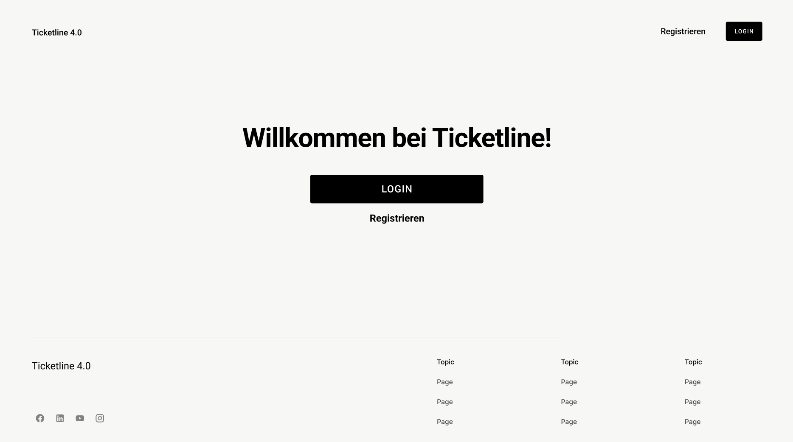
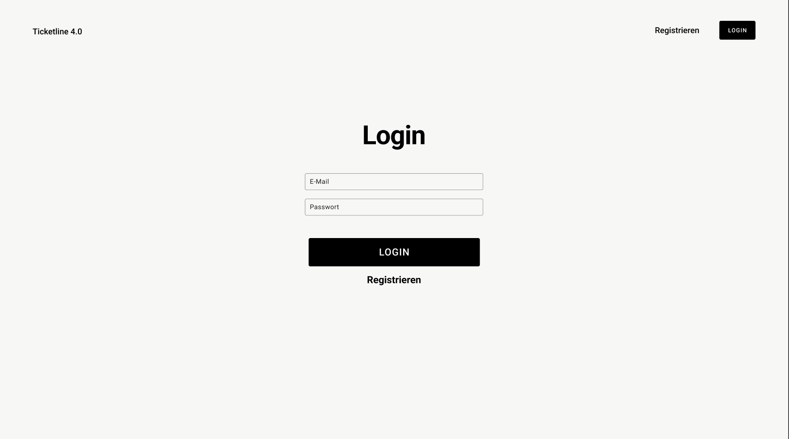
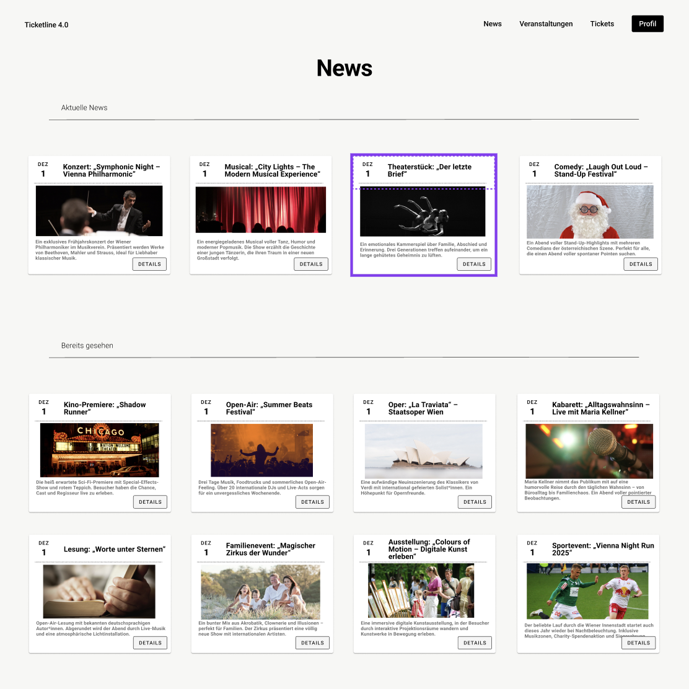
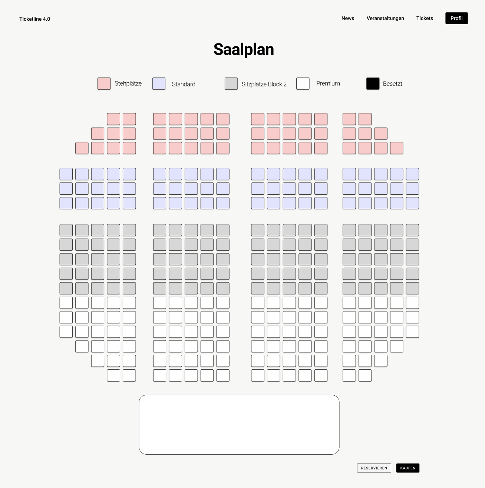
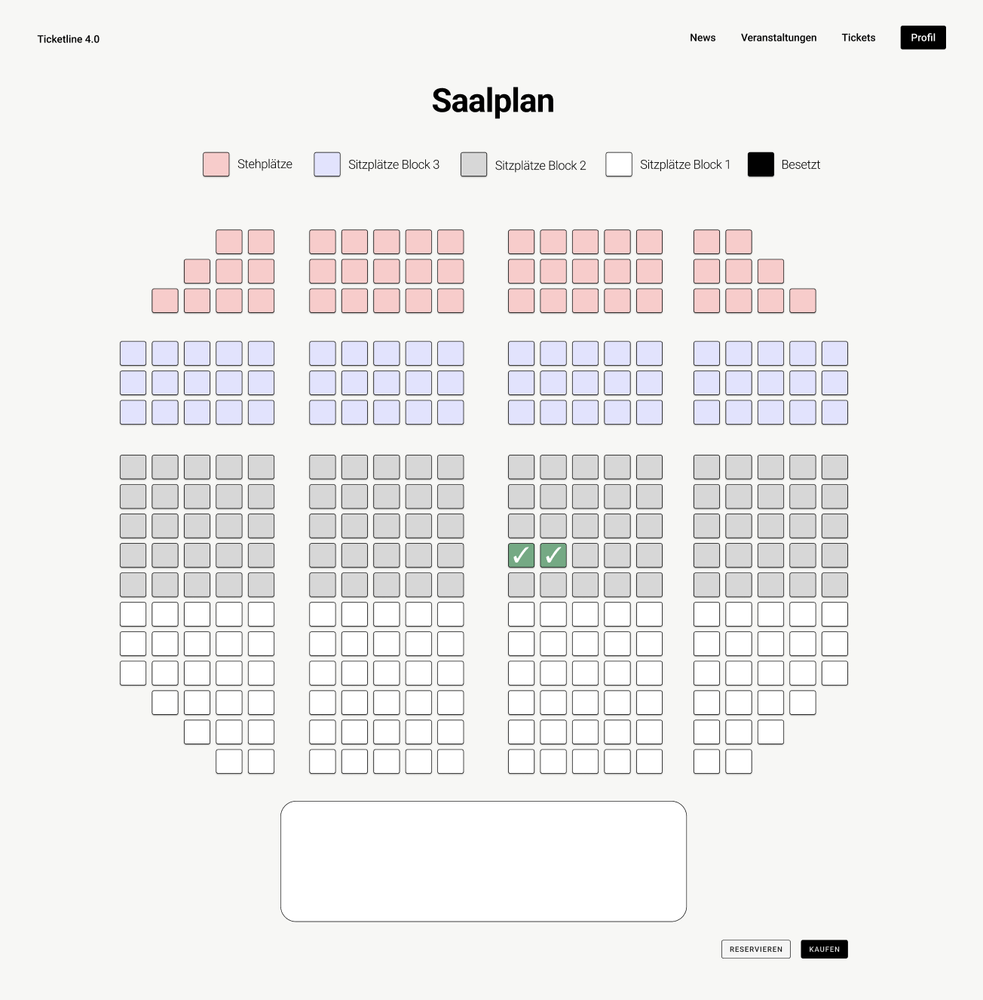

# 🎭 Event Seatmap Platform

A full-featured **event ticketing and dynamic seatmap management platform** built with **Angular**, **Spring Boot**, and **Java**.

This project demonstrates full-stack engineering skills: complex algorithmic seatmap generation, REST backend architecture, Angular component design, database modeling, and clean CI-ready project structure.

---

## 📸 Showcase

### 🏁 Start Screen

### 🔐 Login Screen

### 📰 News & Events Overview

### 🪑 Seatmap Overview

### 🎯 Selected Seats Example

### 🎟 Tickets Screen

---

## 🚀 Features

### 🪑 Dynamic Seatmaps
- 4 predefined seatmap variants (theatre, concert hall, center stage, trapezoid)
- Fixed seat-numbering → removing seats never shifts the structure
- Advanced layout support:
  - TOP / BOTTOM / CENTER stages  
  - Rectangular stage boxes  
  - Catwalk (T-shape) support  
  - Blocked rows & columns  
  - Custom aisles and gaps per row  

### 🎟 Ticket & Event Management
- Events automatically inherit the seatmap of their assigned location
- Backend auto-generates:
  - Tickets  
  - Reservations  
  - Invoices  
- Price logic based on seat category
- Support for artists, bands, and multiple event types

### 🏟 Location System
Each location contains its own:
- Stage configuration (position + dimensions)
- Sectors (A, B, C, Standing)
- Price categories
- Fully auto-generated seats

### 🌱 Backend Data Generator
The DataGenerator creates:
- Users
- Locations + sectors + seats
- Detailed seatmaps per location
- Events with dates, types & artists
- Tickets, reservations & invoices
- Merchandise items
- News feed entries

---

## 🧩 Tech Stack

### Frontend
- **Angular 17**
- TypeScript
- SCSS
- Custom Seatmap Rendering Component

### Backend
- **Spring Boot 3**
- Java 21
- Spring Security
- Hibernate / JPA
- REST API

### Database
- **H2** (development)
- JPA model for:
  - Events
  - Locations
  - Sectors
  - Seats
  - Tickets
  - Artists
  - Price categories
  - Merchandise
  - Invoices & reservations

---

## 📁 Project Structure
